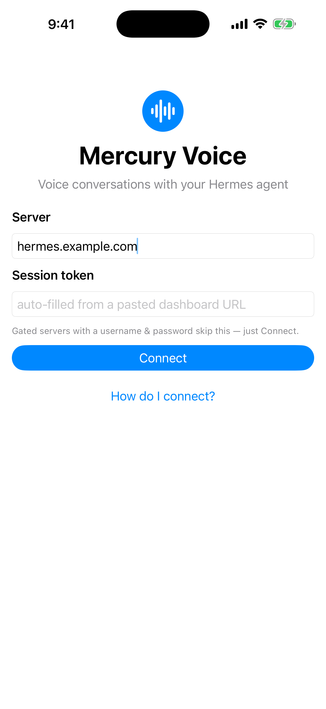
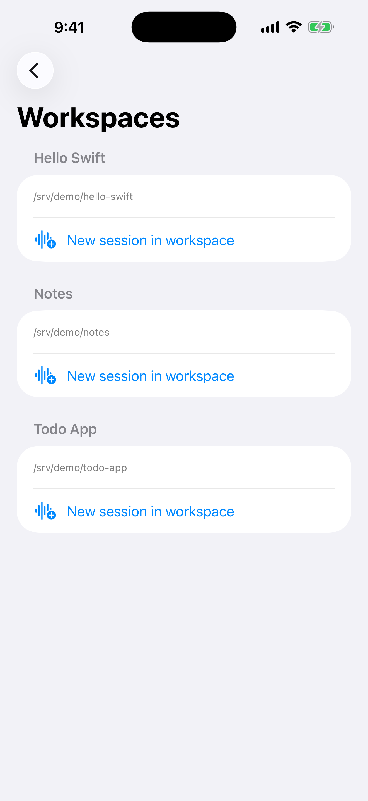
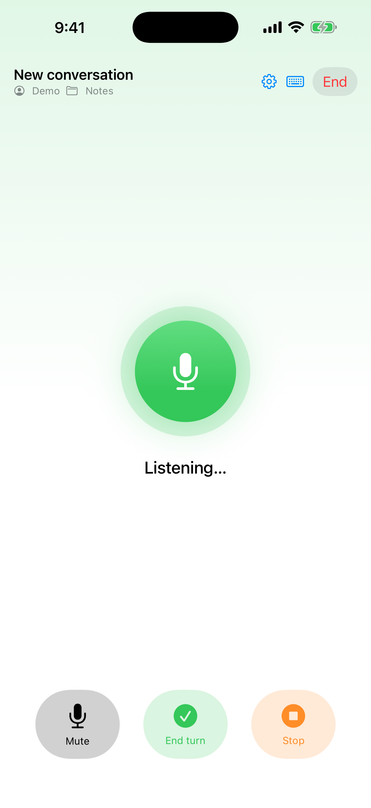
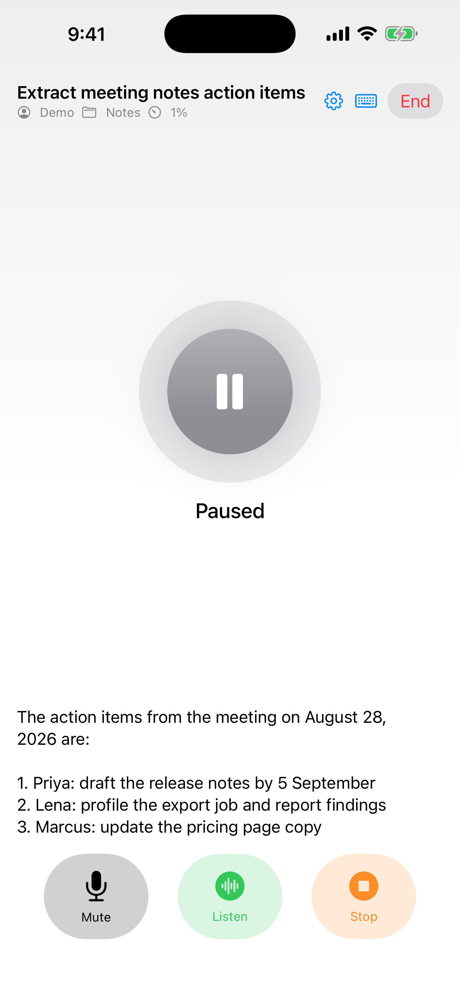
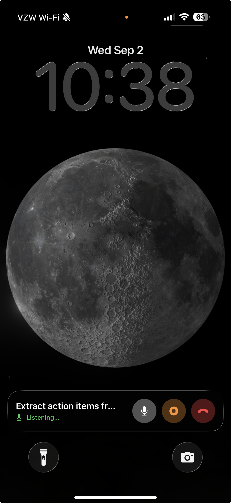

# Mercury Voice

A native SwiftUI voice-conversation client for [Hermes Agent](https://github.com/NousResearch/hermes-agent) — macOS 14+ and iOS 17+ from one multiplatform Xcode project. It speaks the same JSON-RPC WebSocket protocol as the Hermes desktop app (loopback token mode, or gated binds with basic-auth password login and/or native OAuth) and replicates its hands-free voice loop: listen → transcribe → submit → speak the streamed reply → re-arm, with full-duplex barge-in and spoken stop words. On iOS an active conversation also shows a lock-screen Live Activity with the current state and mute / stop / end controls.

Built and verified against desktop contract **v6** (hermes-agent `main` as of 2026-08-25); a v5-or-older backend shows a "backend is older than the app was built for" notice.

## Screenshots

<p align="center">
  
  
  
  
  
</p>

Left to right: enter a server address (a password form appears if the server is gated), pick a workspace, talk, read along with the spoken reply, and keep talking from the lock screen — the Live Activity shows the session state with mute, stop, and end controls.

## Building

Open `MercuryVoice.xcodeproj` in Xcode 16+ and run the `MercuryVoice` scheme, or:

```bash
xcodebuild -project MercuryVoice.xcodeproj -scheme MercuryVoice -destination 'platform=macOS' build
```

```bash
xcodebuild -project MercuryVoice.xcodeproj -scheme MercuryVoice -destination 'generic/platform=iOS Simulator' build
```

Unit tests (state machine, failure-recovery paths, barge detector, echo guard, sanitizer, stop words, protocol models, endpoint/credential parsing, OAuth/PKCE, project decoding, resampler, client-direct voice wires, reconnect replay decoding; the command reports the current test count):

```bash
cd Packages/MercuryVoiceCore && swift test
```

## Architecture

```
Packages/MercuryVoiceCore/
├── HermesKit      # protocol layer — no UI, no audio
│   ├── ServerEndpoint      URL/token parsing (accepts pasted dashboard URLs)
│   ├── HermesAuthenticator credential state: token header vs Bearer, password
│   │                       login, /auth/native/refresh rotation, ws-tickets
│   ├── NativeOAuth         RFC 8252 PKCE flow: S256 challenge, one-shot loopback
│   │                       redirect listener, /auth/native/token exchange
│   ├── GatewayClient       one /api/ws JSON-RPC socket: correlation + event demux
│   ├── HermesConnection    reconnect supervisor (full-jitter backoff, stable event stream)
│   ├── SessionAPI          session.create/resume (deferred history), prompt.submit,
│   │                       projects.tree, approval.respond / clarify.respond
│   ├── RESTClient          /api/status, /api/profiles, sessions, transcribe, speak
│   └── KeychainTokenStore  per-server credentials (session token or password session)
├── VoiceEngine    # audio + the conversation state machine
│   ├── ConversationEngine  idle→listening→transcribing→thinking→speaking→re-arm
│   │                       (port of the desktop's use-voice-conversation.ts;
│   │                       generic over Clock, fully unit-tested with fakes)
│   ├── AgentTurnTracker    synthesizes reply "bubbles" from message.* events,
│   │                       busy tracking, spoken watermark
│   ├── MicRecorder         AVAudioEngine capture + VAD (0.075 / 1250ms / 12s / 60s)
│   ├── BargeDetector/-Monitor  noise-floor calibration, 300ms·80% majority trip,
│   │                       playback clamp 0.14–0.37, 5s pre-roll, 1250ms endpoint
│   ├── RateLockedResampler locks capture to one sample rate across route changes
│   │                       (AirPods ↔ speaker) so VAD thresholds stay calibrated
│   ├── SpeakStreamSession  /api/audio/speak-stream WS → int16 PCM → gap-free player
│   ├── DirectVoice         client-direct STT/TTS: voice-config cache, provider
│   │                       wires, sentence cutter, per-clip speech session
│   ├── HermesSpeechOutput  direct-first, speak-stream relay, whole-clip fallback;
│   │                       stop/sequence protocol
│   ├── SpeechText          TTS sanitizer (tables/fences/links/emoji, desktop parity)
│   └── StopWords           full-utterance match with address-prefix stripping
MercuryVoice/      # SwiftUI app: Connect → Browse (profiles+projects) → Conversation
MercuryVoiceWidgets/  # widget extension: lock-screen / Dynamic Island Live Activity
```

Key protocol facts honored (verified against the hermes-agent source):

- **Two-ID model** — every RPC takes the ephemeral runtime `session_id`; reconnects re-`session.resume` by the durable stored id and re-anchor to the result's `resumed` field.
- `prompt.submit` returns immediately; completion is `message.complete` only (busy gate).
- `prompt.submit` refusals branch on the machine-readable `error.data.reason` (`SESSION_NOT_OWNED` / `MAX_CONCURRENT_SESSIONS` / `SESSION_COORDINATION_UNAVAILABLE`, backends ≥ 2026-08-31) — never on the message prose — and error 5072 (state.db unavailable, message not saved) maps by code; each gets a spoken-friendly notice, with a generic fallback for unknown reasons.
- The speak-stream gets `{"done": true}` only when the reply is non-pending **and** the turn is no longer busy, so trailing narration isn't cut off; `{"type":"fallback"}` reroutes to whole-clip TTS.
- Empty transcript = silence → quietly re-listen (never an error toast).
- `approval.request` is session-keyed (no request_id); `clarify.request`/`clarify.expire` correlate by `request_id`; both pause the voice loop and speak a short notice.
- `session.resume` replays a prompt the session is parked on (`pending_approval` / `pending_clarify`) — a question asked while the app was disconnected reappears on reconnect, and a stale local prompt (answered elsewhere or expired) is cleared.
- Resumes send `defer_history: true`: the RPC answers immediately and the transcript hydrates in the background (`session.resume_progress` events; a "Loading session history…" notice while it runs). Older backends ignore the flag.
- `session.usage` ticks (~1/s while a turn runs) drive a live context-window chip in the conversation header, settled by the authoritative `message.complete` usage; the chip hides when the backend reports no real occupancy.
- Quiet sockets during a busy turn are healthy (server disables WS pings on loopback binds) — no read timeout. Instead, app-foreground probes a seemingly-ready socket with `gateway.ping` and force-redials on failure (half-open sockets after device wake / network switch).
- **Lossless reconnect**: events carry a per-session `seq` and `gateway.ready` carries a `replay_epoch`; after a reconnect that gets the same runtime session back under the same epoch, `session.events.since` replays the missed frames (so a reply that streamed while the app was away is spoken from where it left off). Any gap signal — cold resume, epoch change, `truncated` ring overrun, old backend — falls back to the tracker reset. A seq watermark dedups replay/live overlap.
- `session.reclaimed` (broadcast) names a session the server reaped (idle timeout, LRU, or the ~20 s WS-orphan reap that also interrupts a running turn); the app surfaces it instead of letting the next prompt fail mysteriously.
- **Client-direct voice**: `GET /api/audio/voice-config` hands the client the profile's STT/TTS provider config (keys in memory only, never persisted or logged); when a direction is client-callable (`openai-multipart`/`xai-stt`/`elevenlabs-stt`, `openai-speech`/`elevenlabs-tts`), the app calls the provider directly — mic audio and reply speech skip the gateway hop. TTS is sentence-cut client-side (server-chunker parity) and played per clip. `{"mode":"relay"}`, unknown wires, fetch failures, and older backends all keep the `/api/audio/*` relay endpoints, which remain the floor. A direct STT provider *rejection* surfaces as the error it is rather than silently re-failing through the relay.
- `projects.tree` / `projects.project_sessions` are called with the selected `profile` for server-side scoping (older backends ignore the param; the client-side preview filter stays as belt-and-suspenders).
- First submit after a barge-in carries `interrupted: true` (120 s latch, like the desktop).

## Connecting

1. On the machine running Hermes: `hermes serve` — it prints/opens `http://127.0.0.1:<port>/?token=...`.
2. Paste that whole URL into the app's server field; the token is lifted out automatically. Credentials persist in the Keychain per server and the app auto-reconnects on next launch.
3. **iPhone → Mac:** a loopback-bound backend refuses non-local peers. Use `tailscale serve` on the Mac (proxies from loopback, so token mode keeps working), an SSH tunnel, or a gated bind with sign-in (below).
4. **Gated binds (sign-in):** for a non-loopback bind, connect with just the server address — the app detects the gate and renders whatever the server advertises (via `auth_flows`): a username/password form, "Continue with *provider*" OAuth buttons, or both.
   - **Basic auth:** configure the backend's basic-auth provider (`dashboard.basic_auth.username` + `password` or `password_hash` in `config.yaml`, or the `HERMES_DASHBOARD_BASIC_AUTH_*` env vars). `POST /auth/password-login` mints access/refresh tokens (lifted from the session cookies into the Keychain).
   - **Native OAuth:** providers advertising `native_pkce` sign in through `ASWebAuthenticationSession` with an RFC 8252 PKCE flow — the gateway only accepts loopback IP-literal redirect URIs, so the app catches the `?code=` redirect on a one-shot `127.0.0.1` listener and exchanges it at `/auth/native/token`.

   Either way the plumbing is shared: REST authenticates with `Authorization: Bearer`, expired access tokens rotate via `/auth/native/refresh`, and each WebSocket dial mints a single-use 30 s ticket via `POST /api/auth/ws-ticket`.
5. **Address parsing:** bare IPs and `localhost` default to `http`, DNS names default to `https`; the app warns before sending a password over plain HTTP.

## Manual verification checklist (live backend)

`[x]` means verified against a live backend, with the run recorded somewhere durable (a PR
body or an issue comment) — not "believed to work." Everything else is unverified, including
things that almost certainly do work. Each tick carries the PR it was recorded in.

Milestone 1 — connect + browse:
- [ ] `/api/status` probe shows version; bad token → clear "token rejected" message
- [ ] Gateway connects, `gateway.ready` received (app reaches the browse screen)
- [ ] Profiles list renders (name/model/provider/skills; default marked); can take ~30 s on big skill trees
- [ ] Projects tree shows explicit projects, repo projects, Home bucket; recents exclude scoped sessions
- [ ] Switching profile refreshes projects + recents

Milestone 1b — basic auth (gated bind, `dashboard.basic_auth` configured):
- [ ] Connect with just the address → sign-in form appears (provider display name shown)
- [ ] Wrong password → "Invalid username or password" (and 429 after ~10 rapid tries)
- [ ] Correct credentials → browse screen; kill + relaunch app → auto-reconnects without prompting
- [ ] Voice conversation works end-to-end (WS + speak-stream mint per-dial tickets)
- [ ] Backend restart (no configured `secret`) invalidates sessions → app returns to the sign-in form with "session expired", username prefilled
- [ ] Loopback token servers still connect exactly as before (legacy keychain items migrate silently)
- [ ] Keychain write failure (e.g. locked keychain) shows an orange "Couldn't save credentials…" notice on the connect and browse screens instead of failing silently (#9)

Milestone 1c — native OAuth (gated bind with an OAuth provider advertising `native_pkce`):
- [ ] Sign-in form shows "Continue with *provider*" only when the server advertises it (password form still shown iff basic auth is also configured)
- [ ] Tapping the button opens the system browser sheet; completing sign-in lands on the browse screen; canceling returns to the form without an error toast
- [ ] Kill + relaunch → auto-reconnects via the stored session; access-token expiry rotates silently through `/auth/native/refresh`

Milestone 2 — text path (keyboard icon in the conversation header):
- [ ] New conversation in a project → `session.info` shows the right cwd/project
- [ ] Typed prompt streams a reply; tool ticker shows `tool.start` names
- [ ] Approval-requiring command surfaces the sheet; each choice unblocks the turn
- [ ] Backend restart mid-conversation → app reconnects and resumes by stored id ("Reconnected." notice)
- [ ] Quit mid-approval, reopen and resume → the sheet reappears (spoken cue included) and is answerable; answer it from the desktop instead → on reconnect the stale sheet clears and listening resumes
- [ ] Long multi-tool turn → the header context chip climbs mid-turn and settles at the end-of-turn value (hidden entirely on backends without context reporting)
- [ ] Resume a session with a long transcript → the conversation screen appears immediately ("Loading session history…" while it hydrates); speaking right away still gets a full-context reply
- [ ] Drop the network mid-reply for a few seconds and restore it → after "Reconnected." the reply keeps speaking from where it left off (event replay); a backend *restart* mid-reply instead resets cleanly
- [ ] Let a session idle past the backend's idle TTL while connected → the "backend reclaimed this session" alert appears instead of a failed next prompt
- [ ] Wake the device from sleep during a conversation → the ping probe redials a dead socket within seconds (no wedged "Thinking…")
- [ ] With a cloud STT/TTS provider (openai/groq/elevenlabs/xai) configured: voice works with the gateway's audio relay untouched — server logs show no `/api/audio/transcribe` / `speak-stream` traffic (client-direct); with local whisper / edge-tts, the relay endpoints are used exactly as before; setting `voice.client_direct: false` in config.yaml forces relay everywhere

Milestones 3–5 — voice:
- [ ] Reply is spoken via speak-stream (streaming TTS provider) with live captions
- [ ] With edge-tts (non-streaming): fallback path plays the whole clip
- [ ] Silence-only turn re-listens quietly after ~12 s; "stop" / "hey hermes stop" ends the conversation; "stop the docker container" goes through as a prompt
- [ ] Barge-in during speech stops playback ≤ ~0.5 s, captures your sentence from the first syllable (pre-roll), submits with the interrupted note
- [ ] Barge-in during generation also sends `session.interrupt`
- [ ] Stop button ends speech and does *not* re-arm; mute/unmute behaves
- [x] Stop pressed while "Transcribing…" shows: nothing is submitted, the mic stays off, Listen brings it back (#20)
- [x] Barge in over a reply, then Stop while that interruption is transcribing: same contract (#20)
- [x] Interrupt the agent with a single word it just said ("stop", "no"): the turn goes through instead of being dropped as self-echo (#20)
- [x] Break the TTS stream path (stop the speak-stream provider): replies fall back to whole-clip audio instead of going silent (#20)
- [ ] iOS: conversation survives screen lock (background audio) and AirPods route changes
- [ ] iOS: Live Activity appears on the lock screen / Dynamic Island with working mute / stop / end controls (bundle support is present; rerun on the release candidate)

macOS mute hotkey (Settings, ⌘,):
- [ ] ⌘⇧M toggles mute during a conversation (default, app focused); Conversation menu shows the shortcut and flips Mute/Unmute
- [ ] Recording a new combo in Settings updates the menu item; Esc cancels; bare letters beep (modifier required, F-keys exempt)
- [ ] "Use shortcut system-wide" mutes while another app is frontmost (Carbon hotkey; no accessibility prompt) and doesn't double-toggle when the app is frontmost
- [ ] Disabling the shortcut removes both the key equivalent and the global registration; settings persist across relaunch

Refusal reasons (#22 — needs a backend ≥ 2026-08-31):
- [ ] `SESSION_NOT_OWNED`: run a turn on a session from `hermes chat`, then speak to the same session here → "Another app is running this session…" and the mic re-arms, not raw pid prose
- [ ] `5072`: `chmod 000` state.db on a scratch profile, speak a prompt → "…couldn't save your message — its session storage needs repair" (restore permissions after)
- [ ] Old backend: force any RPC error against a pre-2026-08-31 backend → generic "Hermes error N: …" still appears
- [ ] Browse still degrades to the flat session list on a backend without `projects.*`

Pre-submission (App Store — see #23):
- [ ] Sandboxed macOS **Release** build completes a native OAuth sign-in (the loopback listener's network-server entitlement is present; verify the signed release candidate)
- [ ] Deny the microphone permission on both platforms → a clear message and a working route into Settings, not a dead end
- [ ] A build uploaded to App Store Connect produces no `ITMS-91053` privacy-manifest email

## Known deviations from the desktop client (deliberate)

- The streaming TTS path sends raw deltas (the server strips markdown per sentence); the desktop does the same — the client-side sanitizer is applied on the whole-clip fallback path, matching `playSpeechText`.
- The fallback player stops + captures the stop-sequence *before* playback (the desktop captures after), so pressing Stop during a fallback clip reliably suppresses the mic re-arm.
- VAD levels are computed on fixed ~43 ms audio-callback hops instead of rAF ticks; normalization is scaled (÷ 42/128) so the desktop's thresholds apply unchanged.

## Not in v1

Text-chat UI beyond the dev screen, transcript history, wake-word detection, editing profiles/config, voice-answered approvals.

## License

MIT — see [LICENSE](LICENSE).
